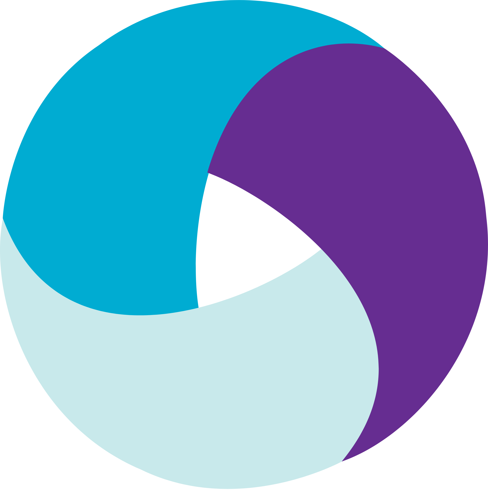
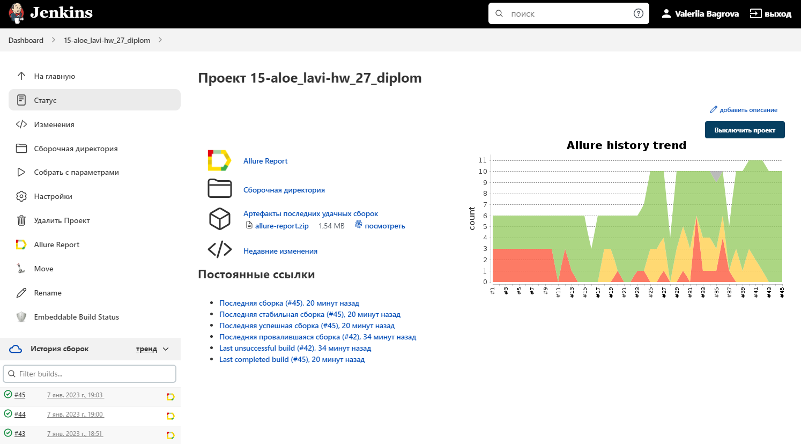
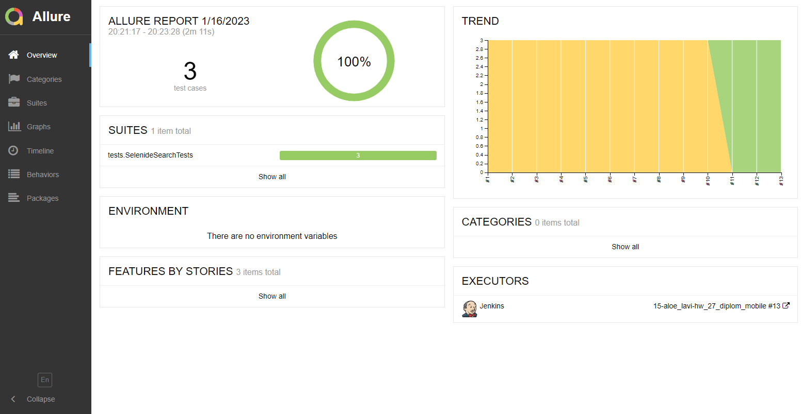
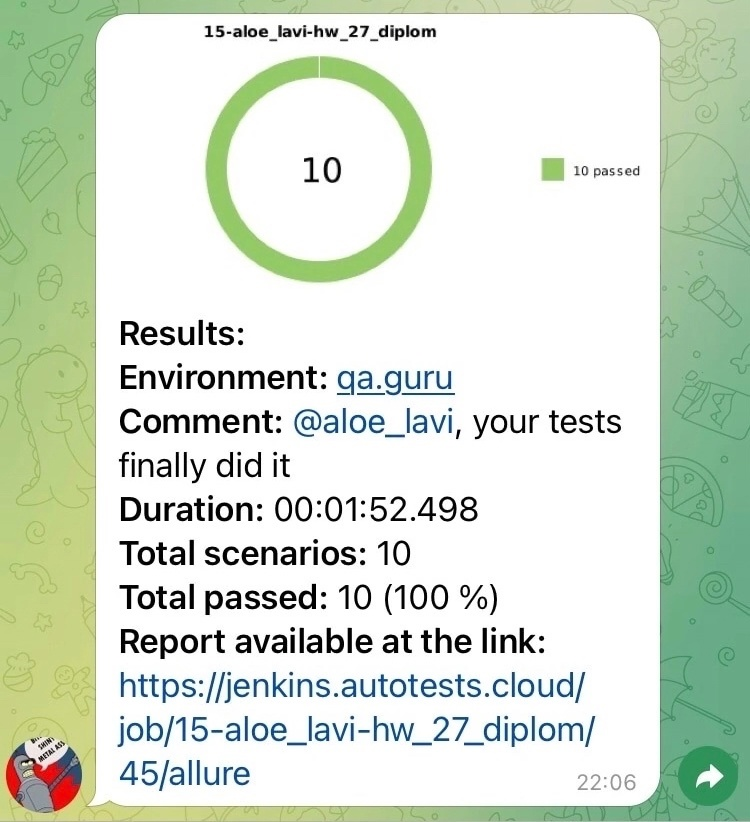

# Проект по автоматизации тестирования мобильного приложения Wikipedia

## :page_with_curl:	Содержание

- [Технологии и инструменты](#rocket-технологии-и-инструменты)
- [Реализованные проверки](#heavy_check_markреализованные-проверки)
- [Запуск тестов из терминала](#computer-запуск-тестов-из-терминала)
- [Allure отчет](#-allure-отчет)
- [Отчет в Telegram](#-уведомления-в-telegram-с-использованием-бота)
- [Видеопримеры прохождения тестов](#clapper-пример-видео-выполнения-теста-в-selenoid)

## :rocket: Технологии и инструменты

<p align="center">





</p>

## 	:heavy_check_mark:	Реализованные проверки

- Поиск
- Открытие статьи
- Добавление нового языка


## 	:computer: Запуск тестов из терминала

### :house_with_garden:	Локальный запуск тестов

```
gradle clean test
```

### :earth_asia: Удаленный запуск тестов
```
clean test
-DdeviceHost=remote
```

### </a>	Страница сборки в [Jenkins](https://jenkins.autotests.cloud/job/15-aloe_lavi-hw_27_diplom_mobile/)
<p align="center">

</p>

## </a> Анализ результатов: Allure

### Главная страница Allure-отчета
Можно увидеть количество и результат выполнения тестов, а также статистику прошлых запусков:
<p align="center">

</p>

### Страница отдельного теста

На странице теста в Allure можно увидеть:
- содержание теста (шаги) 
- результат выполнения каждого шага и теста целиком

<p align="center">

</p>

К каждому тесту прилагается: 
- скриншот последнего действия
- page source
- в случае падения тестов выводится подробный текст ошибки 


## </a> Пример видео выполнения теста в Browserstack

> В Browserstack можно посмотреть видео прогона каждого теста: 
<p align="center">
  
</p>

## </a> Уведомления в Telegram с использованием бота

<p align="center">

</p>
