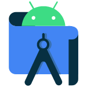
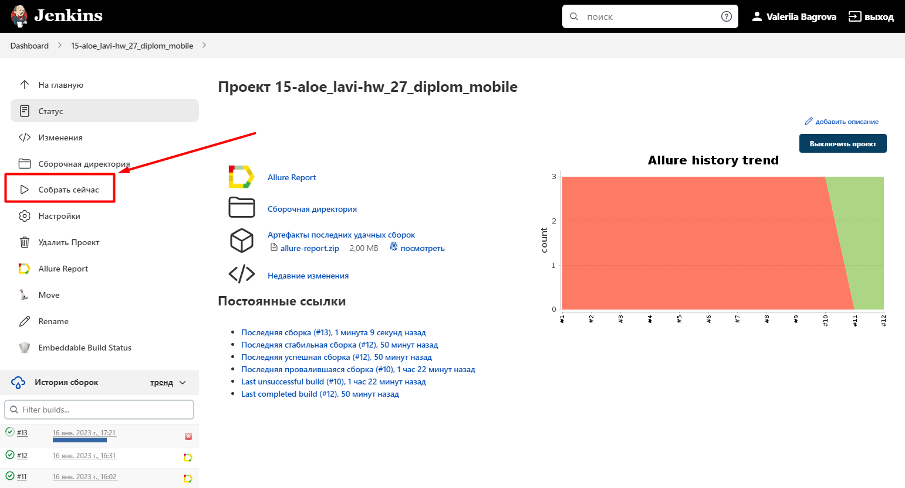

# Проект по автоматизации тестирования мобильного приложения Wikipedia

## :page_with_curl:	Содержание

- [Технологии и инструменты](#rocket-технологии-и-инструменты)
- [Реализованные проверки](#heavy_check_markреализованные-проверки)
- [Запуск тестов из терминала](#computer-запуск-тестов-из-терминала)
- [Анализ результатов: Allure](#-анализ-результатов-allure)
- [Видеопримеры прохождения тестов](#-пример-видео-выполнения-теста-в-browserstack)


## :rocket: Технологии и инструменты

<p align="center">





</p>

## 	:heavy_check_mark:	Реализованные проверки

- Поиск
- Открытие статьи
- Добавление нового языка


## 	:computer: Запуск тестов из терминала

### :house_with_garden:	Локальный запуск тестов

```
gradle clean test
```

### :earth_asia: Удаленный запуск тестов
```
clean test
-DdeviceHost=remote
```

### </a>	Страница сборки в [Jenkins](https://jenkins.autotests.cloud/job/15-aloe_lavi-hw_27_diplom_mobile/)
Для запуска сборки необходимо нажать кнопку <code><strong>*Собрать*</strong></code>.
<p align="center">

</p>

## </a> Анализ результатов: Allure

### Главная страница Allure-отчета
Количество и результат выполнения тестов, а также статистика прошлых запусков:
<p align="center">

</p>

### Страница отдельного теста

К каждому тесту прилагается:
- скриншот последнего действия
- page source
- в случае падения тестов выводится подробный текст ошибки

<p align="center">

</p>


## </a> Пример видео выполнения теста в Browserstack

В Browserstack можно посмотреть видео прогона каждого теста: 
<p align="center">
  
</p>
